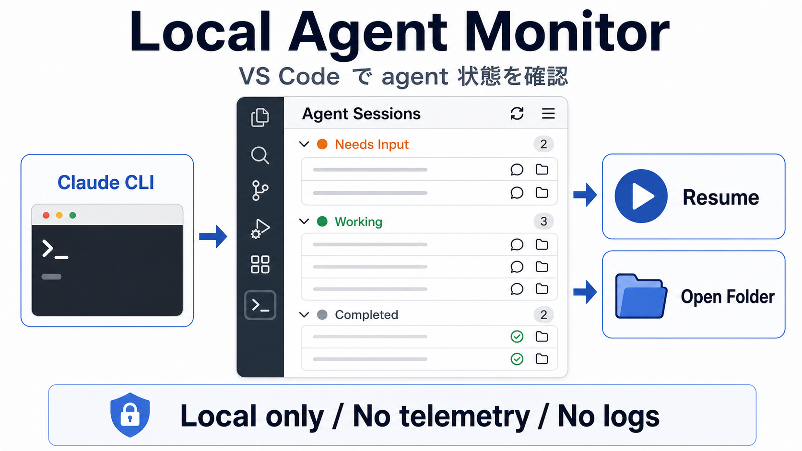

# Local Agent Monitor



Local Agent Monitor is a local-first VS Code sidebar for Claude Code background
agent sessions. It helps you see which agents need input, which are working, and
which have completed without leaving VS Code.

[Download the latest VSIX](https://github.com/gonta223/local-agent-monitor/releases/latest)

## 日本語

Local Agent Monitor は、Claude Code のバックグラウンド agent セッションを
VS Code のサイドバーで確認するためのローカルファーストな拡張機能です。

複数の agent を並行して動かしているときに、どのセッションが作業中か、
入力待ちか、完了済みかを VS Code から素早く確認できます。

### できること

- VS Code のアクティビティバーに agent セッション一覧を表示
- `Needs Input`、`Working`、`Other`、`Completed` に分類
- 手動更新または一定間隔での自動更新
- 公式の Claude Agent View をターミナルで開く
- 選択したセッションを VS Code ターミナルで resume
- セッションIDをコピー
- セッションの作業フォルダを開く

### 使い方

1. [Releases](https://github.com/gonta223/local-agent-monitor/releases/latest) から `.vsix` ファイルをダウンロードします。
2. VS Code の `Extensions: Install from VSIX...` を実行します。
3. ダウンロードした `.vsix` を選択します。
4. VS Code のアクティビティバーに表示される `Agents` ビューを開きます。

### 必要なもの

- VS Code 1.90.0 以上
- Claude Code CLI
- `claude` コマンドがPATHにあること

`claude` コマンドが見つからない場合は、VS Code設定の
`localAgentMonitor.claudePath` にClaude Code CLIのパスを指定してください。

### プライバシー

この拡張機能はローカルファーストです。

- セッション情報を外部サービスへ送信しません。
- テレメトリは含まれていません。
- プロジェクトファイルや Claude の会話ログ本文は読み取りません。
- 設定された Claude Code CLI コマンドをローカルで実行するだけです。

### 注意

この拡張機能は Anthropic 公式の拡張機能ではありません。
Claude Code CLI がローカルで利用できる環境向けの補助ツールです。

## How It Works

The extension shells out to the local Claude Code CLI and reads JSON output:

```bash
claude agents --json
```

When completed sessions are enabled, it reads:

```bash
claude agents --all --json
```

## Features

- View background agent sessions in the VS Code activity bar.
- Group sessions by needs input, working, other, and completed.
- Refresh manually or on an interval.
- Open the official Claude Agent View in a terminal.
- Resume a session in a VS Code terminal.
- Copy a session ID.
- Open a session folder.

## Installation

1. Download the `.vsix` file from the [latest release](https://github.com/gonta223/local-agent-monitor/releases/latest).
2. Run `Extensions: Install from VSIX...` in VS Code.
3. Select the downloaded `.vsix` file.
4. Open the `Agents` view from the Activity Bar.

## Requirements

- VS Code 1.90.0 or newer.
- Claude Code CLI available as `claude`, or configured through
  `localAgentMonitor.claudePath`.

## Settings

- `localAgentMonitor.claudePath`: path or command name for the Claude Code CLI.
- `localAgentMonitor.showCompleted`: include completed sessions with `--all`.
- `localAgentMonitor.refreshIntervalMs`: auto-refresh interval in milliseconds.
- `localAgentMonitor.resumeArgs`: optional extra arguments for resume commands.

The default resume command does not add permission bypass flags.

## Privacy

This extension is local-first.

- It does not send session data to any external service.
- It does not include telemetry.
- It does not read project files or Claude transcript logs.
- It only shells out to the configured Claude Code CLI command.

See [PRIVACY.md](PRIVACY.md) for details.

## Limitations

- This is not an official Anthropic extension.
- It does not embed the official Claude Agent View terminal UI.
- It does not implement Claude Code approval prompts inside a custom webview.
- It depends on the local Claude Code CLI output format.

## Local Development

Open this folder in VS Code and run:

```bash
code --extensionDevelopmentPath="$PWD"
```

Run local checks:

```bash
npm run check
```

Package a local VSIX:

```bash
npm run package
```
